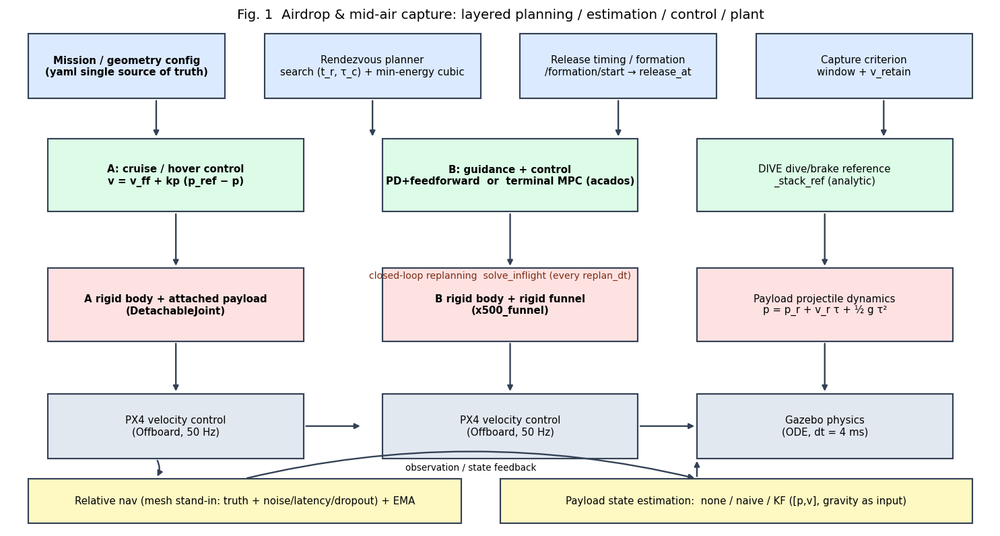
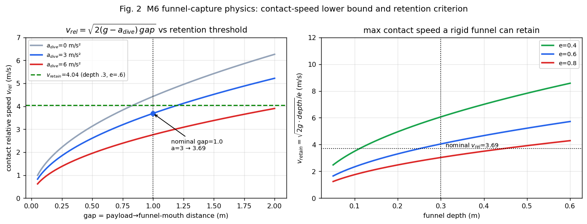
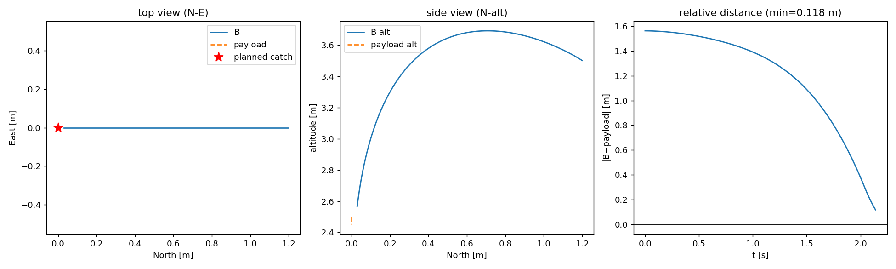
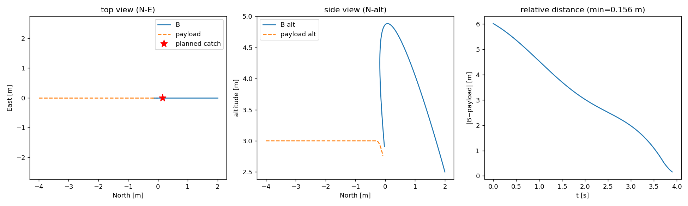
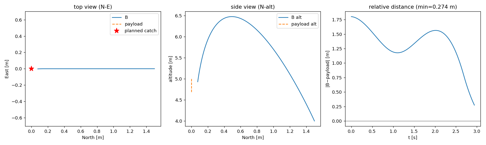
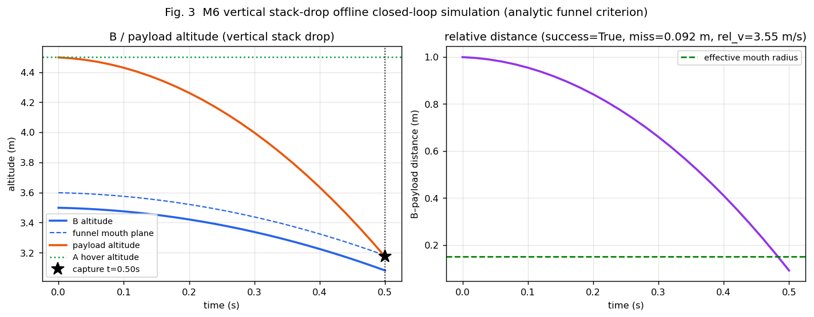
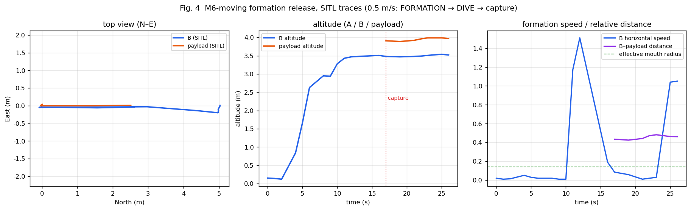
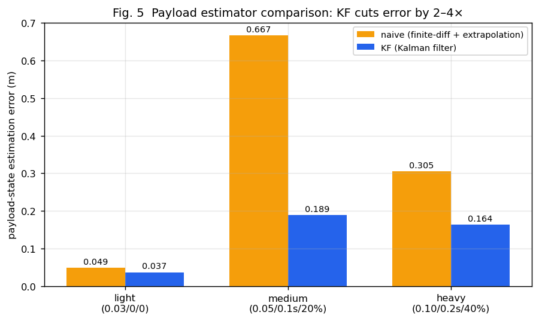

# 空投—空中捕获：方向总述

> **主题**：无人机 A 携载重物飞行并投送，无人机 B 在空中**到达会合点**接住载荷（位置必须到达、相对速度尽量小）。
> 本文按「**被控对象描述 → 控制算法描述 → 仿真图表**」组织，是一份可独立阅读的方向总述。
> 项目仓库：`drone_payload_catch`；坐标统一用**世界系 NED**（x=北, y=东, z=下），高度 = `-z`。
> 图表可用 `python3 tools/make_report_figures.py` 一键重生成（另含 `offline_*.png`）。

---

## 1. 被控对象描述

### 1.1 系统组成与任务形态

被控系统由三部分组成：**投送方 A（带载荷）**、**接收方 B（带捕获机构）**、**载荷（抛体）**。

| 阶段 | A | B | 载荷 |
|---|---|---|---|
| 接近/对正 | 悬停或恒速直线飞行 | 起飞→爬升→横移→对正 | 由 A 携带/挂载 |
| 释放 | 在算出的 `t_r` 释放 | 进入制导/下潜 | 离手后做抛体运动 |
| 会合 | 继续飞离 | 机动到会合点/下潜拦截 | 被接住并保持 |
| 收尾 | 各自飞离并降落 | 携带载荷飞离并降落 | 随 B 落地 |

第一版把 A 的运动简化为**恒速直线** `p_A(t)=a_init + a_vel·t`（`a_vel=0` 即悬停释放），
B 的运动为**双积分器 + 速度/加速度限幅**。

### 1.2 坐标系与符号

| 符号 | 含义 |
|---|---|
| `p_A, v_A` | A 的位置 / 速度（世界 NED） |
| `p_B, v_B` | B 的位置 / 速度 |
| `p_p(τ), v_p(τ)` | 载荷位置 / 速度，`τ = t − t_r`（离手后时间） |
| `p_r, v_r` | 释放点 / 释放速度（= 释放瞬间 A 的状态） |
| `p_c, v_c` | 会合点 / 会合速度；`t_c = t_r + τ_c` |
| `p_B0, v_B0` | B 的起始/待命状态 |
| `g` | 重力加速度（NED 下 `[0,0,g]`，`g=9.81`） |
| `a_max, v_max` | B 的加速度/速度范数上限 |
| `T = τ_c` | B 的会合机动时长 |

### 1.3 载荷（抛体）动力学 —— 核心被控对象

无阻力解析模型（`payload_model.py`）：

```
p_p(τ) = p_r + v_r·τ + ½ g·τ²
v_p(τ) = v_r + g·τ                    （g = [0, 0, 9.81] m/s²）
```

- 释放瞬间载荷**继承 A 的速度** `v_r = v_A(t_r)`（M6-moving 用 Gazebo `DetachableJoint` 实现，物理正确）。
- 可选 `linear`/`quadratic` 阻力与常值风（作鲁棒性输入，`drag_mode ∈ {none, linear, quadratic}`）。
- 关键量：下落 `τ` 后的**竖直速度** `v_z = v_r,z + g·τ`；捕获点高度 `-p_p(τ_c)`。

### 1.4 无人机（执行层）动力学

- **规划/控制模型**：双积分器 `p̈ = a`，约束 `|a|≤a_max, |v|≤v_max`。
- **实际执行**：PX4 Offboard **速度控制**（50 Hz），Gazebo 里为刚体 + 电机模型（ODE，`dt=4 ms`）。
- **A 模型**：标准 `x500`（如需带载可为 `x500` + `DetachableJoint` 挂载载荷）。
- **B 模型**：自定义 `x500_funnel`（`<include merge>` 复用 x500 + 顶部刚性圆锥漏斗），
  经 `PX4_GZ_MODEL_NAME` 附着，不改 PX4 树。
- 位置换算：PX4 `pos_world.z` 比模型绝对高度低 0.24 m（x500 `base_link` 在模型 z=0.24），
  漏斗口判据需加 `px4_z_bias=0.24`。

### 1.5 M6 垂直堆叠投放的几何与漏斗

A 悬停在 B **严格正上方** `gap` 米，两者水平速度为零、投影重合时释放；载荷纯垂直自由落体；
B 以 `a_dive` **温和下潜**、接触后以 `a_brake` 刹停。

**接触相对速度下界**（B 只能往下压，`a_B < g`）：

```
v_rel = √( 2·(g − a_dive)·gap )
```

**刚性漏斗保持判据**（`stack_drop.py`）：

```
位置：载荷落到漏斗口平面时，水平偏差 <  mouth_radius − object_radius
速度：接触相对速度 ≤ v_retain = √(2·g·depth) / e        （e = 恢复系数）
```

### 1.6 主要参数（单一真值源 `config/catch_scenarios.yaml`）

| 参数 | 值 | 说明 |
|---|---|---|
| `g` | 9.81 m/s² | 重力 |
| `payload.mass` | 0.30 kg | 载荷质量（Gazebo 立方体 0.06 m） |
| `drone_b.max_speed / max_accel` | 5.0 / 6.0 | B 速度/加速度上限 |
| `capture.radius / rel_speed` | 0.30 m / 1.50 m/s | M1–M4 捕获判据 |
| `funnel.mouth_radius / depth / restitution` | 0.20 / 0.30 / 0.60 m | M6 漏斗 |
| `funnel.mount_height` | 0.10 m（SITL 0.21） | 漏斗口在 B 机体上方 |
| `funnel.object_radius` | 0.05 m | 载荷等效半径 |
| `stack.a_dive / a_brake` | 3.0 / 6.0 m/s² | M6 下潜/刹车 |
| `stack.formation.vel` | [0.5, 0, 0] m/s | M6-moving 编队速度 |
| `planner` 权重 | `w_time=.2, w_accel=1, w_vel=5` | 会合代价权重 |

---

## 2. 控制算法描述



> **图 1（`fig_control_architecture.png`）** 分层架构：**规划层**（会合 `(t_r,τ_c)` 搜索、释放时序）
> → **制导/控制层**（A 巡航、B 的 PD+前馈 / 终端 MPC、DIVE 参考）
> → **被控对象层**（A/B 刚体、载荷抛体）→ **估计层**（相对定位 + 载荷状态 KF）→ 反馈闭环。

### 2.1 会合规划：`(t_r, τ_c)` 联合搜索

在二维网格上取使代价最小者（`rendezvous.py`）：

```
J = w_time·t_r + w_accel·(峰值加速度 / a_max) + w_vel·|Δv|²  (+ w_overshoot·过冲)
s.t.  |v(t)| ≤ v_max,  |a(t)| ≤ a_max,  离地余量,  h_c ∈ [catch_alt_min, catch_alt_max]
```

其中 `Δv = v_c − v_p(τ_c)` 为终端速度失配；`t_r` 由 B 通过 `/payload/release_at` 广播给载荷节点。

### 2.2 B 的会合轨迹：min-energy 三次多项式（解析）

对**双积分器、两端位置/速度固定、min ∫|a|²dt**，每轴解析解为三次多项式：

```
x(t) = c0 + c1 t + c2 t² + c3 t³
c0 = x0,  c1 = v0,  c2 = 3D/T² − Δv/T,  c3 = −2D/T³ + Δv/T²,   D = x1 − x0 − v0 T
```

若"终端速度精确匹配"不可行（如载荷速度超 B 限速），退为**软终端速度**解析解
`min ∫a²dt + w·(v(T)−v_ref)²`（位置仍硬到，速度按权重折中）。

### 2.3 B 的跟踪控制：PD + 解析前馈 或 终端 MPC

- **PD + 前馈**（默认，`controller='pd'`）：`v_sp = v_ref(t) + kp·(p_ref(t) − p_B)`。
- **终端 MPC**（`controller='mpc'`，acados）：状态 `[p,v]`、控制 `u=a`，跟踪会合参考 + 终端代价；
  `|u|≤a_max` 硬约束、`|v|≤v_max` 软约束。返回 `(u0, status, v_next)`，`v_next` 作速度前馈设定点。

### 2.4 闭环重规划（`solve_inflight`）

载荷离手后每 `replan_dt` 用**当前观测的载荷状态**重解会合 `solve_inflight(p_p, v_p, p_B, v_B)`，
滚动更新 B 的参考，抵抗释放误差与模型失配（风/阻力）。

### 2.5 载荷状态估计（KF）

- 状态 `x=[p,v]`，重力为**已知输入**，按测量时间戳 **predict → update**，天然处理延迟/丢包。
- 对照 `naive`：最近测量 + 有限差分 + 弹道外推；`none`：用真值（理想上界）。

### 2.6 M6 垂直投放的解析规划与漏斗判据

- **规划**：`plan_stack_drop(a_height, b_height, a_dive, ...)` 求接触时间 `t_c` 与接触速度 `v_rel`，
  给出 B 的"下潜→刹车→悬停"分段参考 `_stack_ref`（`stack_drop.py`，纯 Python）。
- **判据**：见 §1.5 的 `v_retain` 与口内有效半径（图 2）。



> **图 2（`fig_funnel_physics.png`）** 左：`v_rel=√(2(g−a_dive)gap)`——下潜越猛接触速度越小，
> 但 B 冲得越低、刹车余量越少；标称 `gap=1.0, a_dive=3 → 3.69 m/s`，低于 `v_retain=4.04`。
> 右：`v_retain` 随漏斗深度/恢复系数的变化。

### 2.7 M6-moving 编队同速投放（新增）

状态机（`mode=stack` 且 `formation_vel≠0`）：

```
CLIMB → WAIT_A → TRANSLATE → ALIGN（同一投影点悬停）
  → B 发 /formation/start
  → A 以 formation_vel 直线巡航；B 进入 FORMATION（目标=A 投影点，前馈=A 速度）
  → 位置+相对速度双阈值对齐并保持 → A 释放（载荷继承 A 速度）
  → DIVE（重锚：等载荷真正下落后下潜；跟踪 A）→ 漏斗捕获 → 双机分开落地
```

关键控制律：
- **A 巡航**：`v = formation_vel + kp·(p_ref(t) − p_A)`，`p_ref(t)=p0 + formation_vel·t`。
- **B 编队**：`v = v_A + kp_xy·(p_A,xy − p_B,xy)`，`vz = −kp_z·(alt_tgt − alt_B)`（`stack_kp_xy=1.2`）。
- **载荷挂载/分离**：`DetachableJoint` 在模型 configure 时即挂载（**不可重复发 attach**），
  分离时载荷**继承 A 的速度**。
- **释放条件**：`rel_xy<align_xy_tol`、`rel_vxy<align_vel_tol`、A 速度 ≥ `ratio·|v_formation|`，稳定保持 `align_hold_s`。
- **DIVE 重锚**：未检测到载荷下落（`vz>dive_anchor_vz`）时**原地悬停等**；捕获窗口 = 漏斗口平面上下 `±catch_z_tol`。

### 2.8 安全层与着陆

- **避碰**：B 先垂直爬升 → 等 A 到位 → 再横移（避免斜插穿 A 的爬升通道）；
  全程保证 B 高度 ≤ A − `min_ab_gap`（默认 0.8 m），并监测 `min‖A−B‖`。
- **着陆**：捕获后保持 `land_after_catch_s`（默认 6 s），A、B 各飞分开落点 `land_xy`
  （相距 ~8.5 m）后发 `VEHICLE_CMD_NAV_LAND` 自动降落。

---

## 3. 仿真图表

### 3.1 离线会合/捕获（M1–M4）



> **图 6（`offline_M1_basic.png`）** M1 悬停投放：俯视轨迹、侧视高度、相对距离。



> **图 7（`offline_M2_line_v10.png`）** M2 带速抛投（A 1.0 m/s 平飞）：规划会合点与 B 的 min-energy 轨迹。


> **图 8（`offline_M3_high.png`）** M3 高抛：下落时间长，闭合重规划有时间裕度。



> **图 9（`offline_M4_high_kf.png`）** M4 含噪/延迟/丢包测量 + KF 的会合。

**离线全工况汇总**（`tools/offline_run.py --all`，13 工况全部 PASS）

| 工况 | 最近距离 | 备注 |
|---|---|---|
| M1_basic / M1_wind | 0.118 m | 悬停释放 |
| M2_line_v05 / v10 / v20 | 0.160 / 0.156 / 0.150 m | 带速抛投 |
| M2_crosswind | 0.151 m | 斜向 |
| M3_high | 0.283 m | 高抛 |
| M3_wind_drag | 0.117 m | 闭环重规划 |
| M3p_line_mpc / M3p_high_mpc | 0.272 / 0.283 m | acados MPC |
| M4_line_naive / kf / high_kf | 0.149 / 0.149 / 0.274 m | 估计滤波 |

### 3.2 M6 垂直堆叠投放（离线）



> **图 3（`fig_m6_stack_offline.png`）** B 下潜/刹车、载荷自由落体在漏斗口平面会合；
> 右侧为相对距离在捕获时刻进入口内有效半径。蒙特卡洛 **200/200**，捕获水平偏差 max 0.096 m。

### 3.3 M6-moving 编队同速投放（SITL 实测）



> **图 4（`fig_m6_sitl_formation.png`）** 从 `~/payload_catch_m6_gui/launch.log` 解析的实测轨迹：
> A（编队参考重建）、B、载荷；虚线标出释放与捕获时刻。
> 两机先到同一投影点悬停，再同向同速 0.5 m/s 巡航，运动中释放并捕获（本次捕获水平偏差 0.042 m）。

### 3.4 载荷估计器对比



> **图 5（`fig_estimator_comparison.png`）** KF 相对 naive 把估计误差稳定降低 **2–4 倍**
> （但端到端成功率在真值基线同样 ~92% 时无明显提升——瓶颈在释放误差与动力学，见 §4）。

### 3.5 关键结果汇总

| 里程碑 | 结果 |
|---|---|
| 离线 M1–M4 | 13 工况全 PASS |
| M3 闭环重规划 | 释放误差 σ=0.2：开环 7/12 → 闭环 **12/12**；风+阻力失配：0/10 → **10/10** |
| M3+ PD vs MPC | 均能捕获；MPC 未超过带解析前馈的 PD |
| M4 KF vs naive | 估计误差降 2–4×；成功率无提升（真值基线同样 ~92%） |
| M6 离线 | **200/200**，捕获水平偏差 max 0.096 m |
| M6 SITL | `STACK CAPTURED`，载荷随漏斗带走，双机分开落地 |
| **M6-moving SITL** | **无窗口 3/3**，捕获水平偏差 0.108–0.128 m；GUI 偶发平台 failsafe |

---

## 4. 结论、负结果与局限

**结论**
1. **会合规划 + 解析 min-energy 参考 + PD 前馈** 是简单而有效的基线；闭环重规划显著提升
   抗释放误差/模型失配能力。
2. **终端 MPC 未超过带解析前馈的 PD**（负结果）：在双积分器 + 已解析最优参考下，PD 已接近最优。
3. **过冲是反馈余量的副产品**（负结果）：把参考压到"不过冲"会用满 `a_max`、降低鲁棒性。
4. **更好的估计器不提升成功率**（负结果）：KF 降误差但真值基线同样 ~92% ⇒ 瓶颈是释放误差 + 动力学限幅。
5. **M6 垂直投放**用独立的解析规划器 + 漏斗物理判据，离线 200/200、SITL 成功。
6. **M6-moving 编队同速投放**：两机同向同速巡航中释放、载荷真实继承 A 速度、成功捕获并带走。

**局限**
- 漏斗为**实心圆锥盘**（非空心导向漏斗），无夹持/保持机构；靠低恢复系数"砸住"。
- 相对定位为 **mesh 替身**（真值 + 噪声/延迟/丢包），非真实视觉/UWB。
- SITL 在本机偶发 **A 端飞控 failsafe**（平台级，非算法）；GUI 渲染负载会放大该问题。
- 捕获水平余量偏小（约 0.01–0.03 m，相对有效半径 0.14 m）。
- 未接住时载荷自由落体砸地，无应急处理；未做真机。

**下一步**：真空心漏斗 + 保持机构；相对定位真实化（UWB/视觉）；推高速度边界（B 的 EKF 鲁棒性）；
不确定性感知的安全层；真机化。

---

### 附：图表清单与生成方式

| 图 | 文件 | 生成 |
|---|---|---|
| 图 1 控制架构 | `figures/fig_control_architecture.png` | `python3 tools/make_report_figures.py` |
| 图 2 漏斗物理 | `figures/fig_funnel_physics.png` | 同上 |
| 图 3 M6 离线 | `figures/fig_m6_stack_offline.png` | 同上 |
| 图 4 M6-moving SITL | `figures/fig_m6_sitl_formation.png` | 同上（解析 `~/payload_catch_m6_gui/launch.log`） |
| 图 5 估计器对比 | `figures/fig_estimator_comparison.png` | 同上 |
| 图 6–9 离线轨迹 | `figures/offline_*.png` | `python3 tools/offline_run.py --scenario <S> --plot` |
